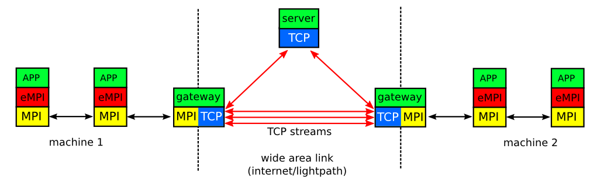

eSalsa-MPI
==========

What is it? 
-----------

This project contains the wide area MPI used in the eSalsa project. 

DISCLAIMER: This code is still experimental!! 

The goal of eSalsa-MPI is to allow traditional MPI applications to 
be run on a -combination- of multiple supercomputers or clusters, 
without changing a single line of code in the application. 

eSalsa-MPI is capable of merging several distict MPI jobs running 
on different supercomputers and present it to the application a 
a single set of MPI tasks. This way, the application "thinks" it 
is running on a single supercomputer, while in reality it it 
running on two or more. 

How does it work? 
-----------------

eSalsa-MPI consists of three components, an MPI wrapper, gateways
and a server, as shown in the example below:

The eMPI wrapper implements (part of) the regular MPI interface.
This allows applications to be compiled against, and linked with, 
eSalsa-MPI instead of a "normal" MPI implementation. This way, 
all MPI calls performed by the application are intercepted
by eSalsa-MPI. 

However, eSalsa-MPI is -not- a complete MPI implementation. Instead, 
most MPI calls are simple forwarded to a local MPI implementation 
by using the MPI profiling interface. Only MPI calls that
require wide area communication are handled differently. 

The server acts as a central contact point that allows
the distict eSalsa-MPI jobs running on different supercomputers to
locate each other. In addition, the server provides support for operations
on communicators and groups. For example, it is up to the server to 
create an MPI_COMM_WORLD communicator that contains all tasks on all 
particiating machines.

It is the tasks of the gateways to forward (local) MPI messages over 
the wide area links and vice versa. To do so, a gateway is connected
to a peer gateway in a remote site via one or more TCP streams. Each 
site may use multiple gateways.

For each MPI call intercepted by eSalsa-MPI a decision is made if the 
call can be handled locally (for example, an MPI_Send to a different 
process in the same cluster) or if it must be forwarded to a local 
gateway that will forward it to a remote site (for example an MPI_Send
between clusters or a collective operation that involves all processes). 

As mentioned above, this code is still experimental. However, its has 
already been used to run both the Parallel Ocean Program (POP) and the 
Community Earth System Model (CESM) in a multicluster setting.  
 
POP can be found at <http://climate.lanl.gov/Models/POP/>

CESM can be found at <http://www2.cesm.ucar.edu/>

How do I install eSalsa-MPI?
----------------------------

First of all make sure you have defined the EMPI_HOME environent variable. 
For example: 

   export EMPI_HOME=/home/jason/eSalsa-MPI

Next, set the "CC" and "FC" variables in $EMPI_HOME/empi.config to refer 
to the C and fortran compilers you which to use. Also set the "MPICC" 
variable to refer to an mpi compiler (script) provided by the local 
MPI you wish to use. 

Next, build eSalsa-MPI like this:

   cd $EMPI_HOME
   make

How do I run eSalsa-MPI?
------------------------

See the "examples/README.md" file for an example on how to use eSalsa-MPI 
in an application.

What is the eSalsa Project?
---------------------------

The eSalsa Project is a cooperation between the Netherlands eScience 
Center (NLeSC), the Institute for Marine and Atmospheric Research (IMAU) 
at Utrecht University, and the Vrije Universiteit Amsterdam (VU). 

The goal of the eSalsa project is to determine to what extent regional sea 
level in the eastern North Atlantic will be affected by changes in ocean 
circulation over the next decades.

During the project we will improve and extend POP with support for 
distributed computing techniques and accelerators (GPUs).

For more information on the eSalsa project see:
 
<http://www.esciencecenter.nl/projects/project-portfolio/climate-research>

The Latest Version
------------------

Details of the latest version can be found on the eSalsa MPI project 
web site at:

<https://github.com/NLeSC/eSalsa-MPI>

Copyrights & Disclaimers
------------------------

Xenon is copyrighted by the Netherlands eScience Center and 
releases under the Apache License, Version 2.0.

See <http://www.esciencecenter.nl> for more information on the 
Netherlands eScience Center.

See the "LICENSE" file for more information. 
